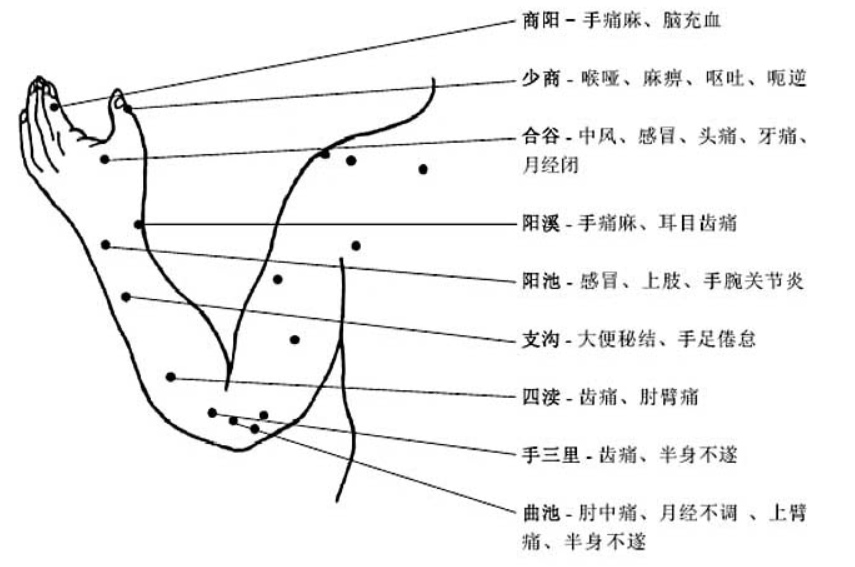

資料庫變數:

| var          | mean                                                         | type   |
| ------------ | ------------------------------------------------------------ | ------ |
| id           | 資料編號                                                     | int    |
| title        | 資料名稱                                                     | string |
| content      | 資料內容                                                     | string |
| disease_type | 可治療疾病類型，這個我覺得要再修改，因為太多種疾病了         | string |
| rel_position | 定位的mediapipe編號                                          | int    |
| offset_x     | x偏移量(-10~10，間距可以再做調整)                            | int    |
| offset_y     | y偏移量(-10~10)                                              | int    |
| customize    | 1: 正面, 2: 背面,3: 正面左邊(手), 4: 背面左邊(手), 5: 正面右邊(手), 6: 背面右邊(手), 7: 其他 | int    |

正面右手(5)

背面右手(6)

背面左手(4)? 資料庫裡面的資料左右手有些還需要確認，因為有完整左右手穴位的網站很少..

左手背面

左手正面

穴位參考網站: 

http://cht.a-hospital.com/w/%E4%BA%BA%E4%BD%93%E7%A9%B4%E4%BD%8D%E5%9B%BE

https://www.acupoint361.com/2018/09/plam-acupoints.html

穴位資料:

https://yibian.hopto.org/db/?ano=429

手部mediapipe參考網站: https://google.github.io/mediapipe/solutions/hands.html