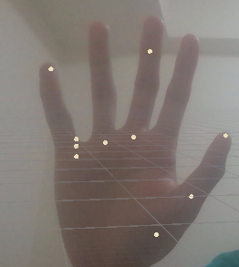

# SeniorProject

執行專案之前需要添加或修改的步驟: [Addon](Addon.md)

[Database](./Assets/DataBase/README.md)

## Dialogueformat

* Symbol

  * Q -- Question

  * C -- choice (選項)

  * L -- line  (行)
  * D -- Default(述說者 -- 現在使用預設 之後可能會有其他人物)

| id   | Dialogue(對話) | Type(類型) | content(內容)                                                | narrator(誰說的) | Opt(選擇項) |
| ---- | -------------- | ---------- | ------------------------------------------------------------ | ---------------- | ----------- |
| 0    | Q1             | L1         | 下列何者屬手太陽小腸經。輸（木）穴。八脈交會穴之一，通督脈。在手掌尺側，微握拳， | D(Default)       | null        |
| 1    | Q1             | L2         | 當第5掌指關節後的遠側掌橫紋頭赤白肉際處。                    | D                | Correct     |
| 2    | Q1             | C1         | 後溪穴                                                       | D                | Wrong       |
| 3    | Q1             | C2         | 二間穴                                                       | D                | Wrong       |
| 4    | Q1             | C3         | 中魁穴                                                       | D                | Wrong       |
| 5    | Q1             | C4         | 太淵穴                                                       | D                | Wrong       |
| 6    | Q2             | L1         | 下列哪些穴位超過兩個以上                                     | D                | null        |
| ...  | ...            | ...        | ...                                                          | ...              | ...         |

## Log

> 7/10

* Add
  * Holistic Scene

>  7/26
* Add
  * Acupuncture point SO

> 7/28
* Add
  * EditorScript -- update inventory
  
  * Acupuncture point Scene (在執行之前記得依序跟新穴道位置和背包有時候資料會跑掉 (在MenuItem的SeniorProject中的 Update acupunture point ScriptableObjects 和 Add all acupunture point to default Inventory))
  
    
  
  * Acupuncutre Solution
  

> 8/2
* add 
  * rasa scene and some art
  * add new script `BotUI.cs`、 `NetworkManager`...
  * add rasa file，in order to run rasa server
* fix
  * fix memory leak bug

> 8/3
* add 
  * add new func to show the return value from AI

TODO: Tutorial UI、syn，asyn、Debug Canvas(什麼時間跑出什麼字串)

> 8/4
* modify
  * merge rasa to Gameplay Scene
* add
  * Inspector ui

> 8/11

* modify
  * package -- HandLandmarkListAnnotation, ListAnnotation, HolisticLandmarkListAnnotation
* add
  * finish Inspector ui
* TODO: hint ui

> 8/12

* add
  * Acupuncture Item Prefab -- UITitle
  * hint panel ui
  
  * Exercise Scene -- Setup
*  modify
  * UIInventoryItem -- change its behavior to favor user action
  * some fix for building

* TODO: switch between hint ui and Acupunture Item Prefab UITitle

> 8/17

* modify
  * DatatBase Update
* add
  * dialogue system

> 8/18
* add
   * Load Question DataBase

> 8/19
* add
  * Auto load Question to Dialogue system
  * Default Question UI-- Setup (Temp)
  * Question Manager
  * about ui panel

* modify
  * Update Database
  * Question DataBase Ans fixed
  * finish Questions
  * QuestionManager -- SO -- more flexable
  * Auto Create DialougeDataSO

> 8/20

* add
  * Quests
  * CutScene
  * NPC 
  * Update Database\Readme.md
  * StateMachine
  * Character

> 8/21

* modify
  * fix questionManager recursion problem

> 8/22

* add
  * MainMenu -- Update

> 8/23

* modify
  * MainMenu -- tweaking

> 8/31

* add
  * Stage1 -- Setup
  * tilemap package
  * CameraManager

> 9/5
* modify
  * Stage1 -- tweaking
  * AI script
  
* add

  * scene/TeachMode

  * Assets/Script/TeachMode -- script to control TeachMode Scene
  * Assets/Art/TeachMode -- TeachMode Scene UI sprite
  * Assets/Animation -- include TeachMode Scene UI animations
  * Chinese_Characters_6151 and new TextMeshPro

> 9/7
* modify
  * Exersice Scene -- update

> 9/9

* add
  * Translation
  * Scene -- HandAcupunturePoint
* modify
  * tweaking
  * fix bug
  * package -- HandLandmarkListAnnotation,ListAnnotation

> 9/10

* add
  * HandAcupunturePoint -- display acupunturepoint function
* modify
  * tweaking

> 9/11

* add
  * new UI element (in art file) include 3 scene
    * over 40 sprite (int Art)
    * over 20 pattern (int Art)
  * add new scene Main (Menu to other Scene)
  * add SceneUI to save script file (Assets\Scripts\UI\ScnenUI )
  * Add transition animation
* modiy
  * merge
  * tweaking

> 9/12

* modify
  * tweaking
  * Head Scene UI add Mask
  * MultiHandLandmarkListAnnotation

> 9/13
* modify
  * package -- PointAnnotation, Landmark
  * tweaking

> 9/15

* modify
  * tweaking

> 9/16

* modify
  * package -- MultiHandLandmarkListAnnotation,HandLandmarkListAnnotation,PointAnnotation
  * scene -- handsimulator

> 9/18

* modify
  * add AR in AI scene，AI script Update

> 9/19

* modify
  * Add new mirror
  * add chinese file vacabulary
* add
  * Add new character(Animation and sprite) made by iwantall2333
  * Add new animation (in ai scene)
  * update new AI UI

> 9/20

* add
  * flip book animation
  * new english title
  * Acupuncture point sprite sheet
  
* bug

  * personal(stereomp3) in exercise exit: 

    * TextureFramePool.cs ondestory() problem
    * HandTrackingGraph.cs stop() problem
    * offset problem

> 9/21

* add
  * new button
